# DSP XML 引擎 — 完整执行流程文档 (v2)

> 基于源码完整分析，覆盖从 HTTP 请求到响应的全链路。（v2：修正与代码不一致的内容）

---

## 1. 总体架构

DSP 引擎采用 **XML 配置驱动 + 多数据源执行 + DAG 并行编排** 的架构。外部请求经过鉴权、解析、编排执行、结果映射四个阶段，最终返回结构化 JSON。

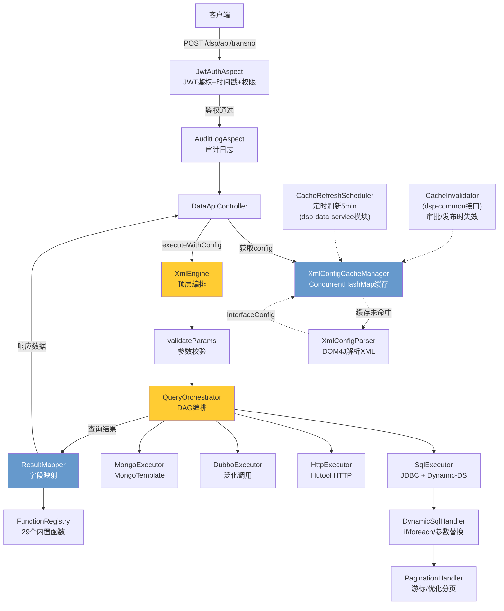

---

## 2. 请求处理全流程

一个完整的 API 请求 `POST /dsp/api/{transno}` 经过以下阶段：

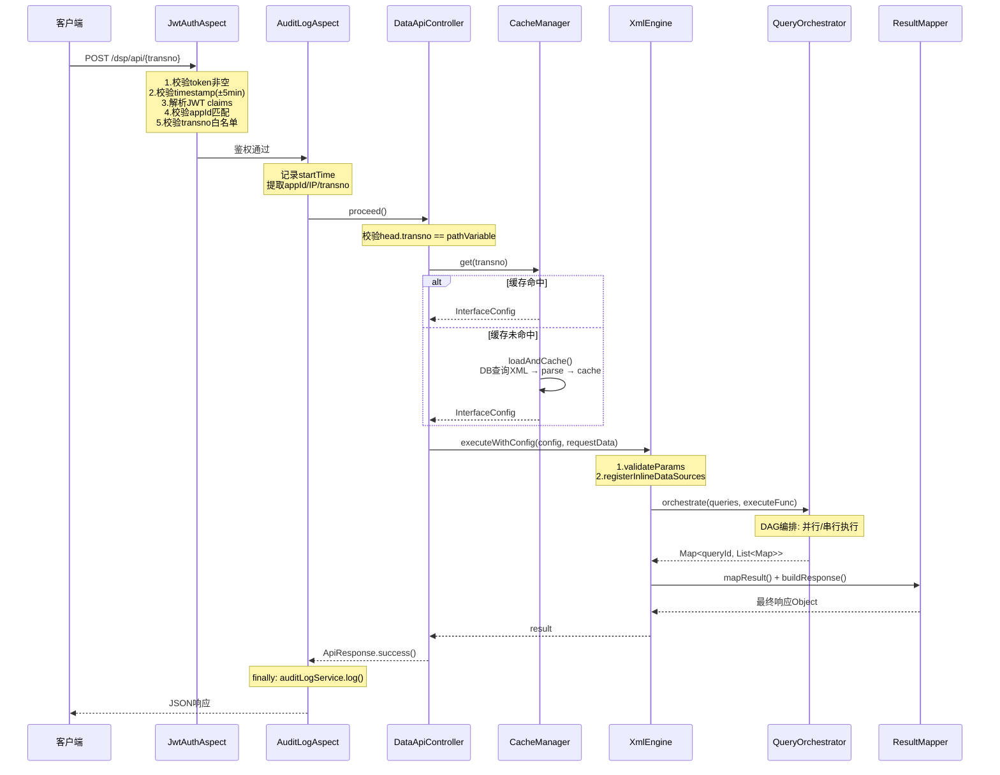

---

## 3. 鉴权阶段 (JwtAuthAspect)

通过 Spring AOP `@Before` 拦截 `DataApiController` 所有方法，执行顺序在审计日志之前。

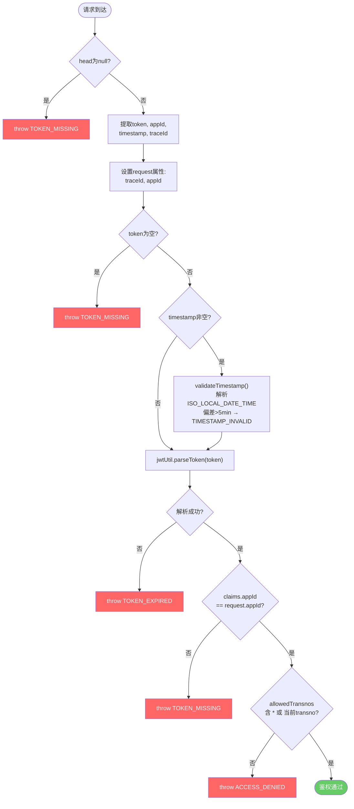

---

## 4. 缓存与 XML 解析

### 4.1 缓存机制

`XmlConfigCacheManager`（dsp-engine 模块）以 `transno` 为 key 缓存已解析的 `InterfaceConfig`，实现了 `XmlConfigCacheInvalidator` 接口（dsp-common 模块）。

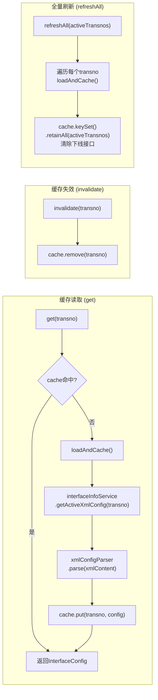

> **注：** `CacheRefreshScheduler` 和 `CacheLoadStrategy` 位于 **dsp-data-service** 模块。定时刷新默认关闭，需配置 `dsp.cache.xml.refresh-enabled=true` 启用。

### 4.2 XML 解析流程

`XmlConfigParser` 使用 DOM4J 将 XML 字符串解析为 `InterfaceConfig` 模型树。

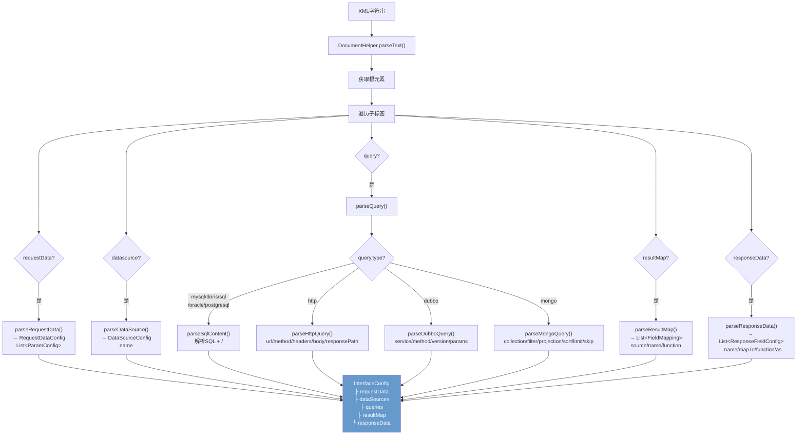

---

## 5. 引擎核心执行 (XmlEngine)

`XmlEngine.executeWithConfig()` 是引擎的顶层入口，协调五个阶段。

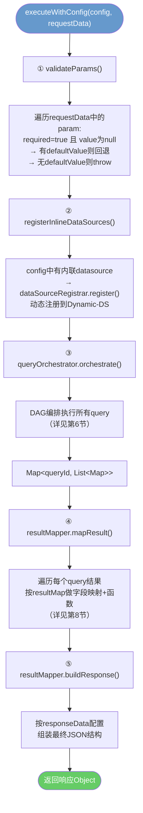

---

## 6. DAG 编排 (QueryOrchestrator)

### 6.1 编排主流程

`QueryOrchestrator` 分析 `<query depends="q1,q2">` 依赖关系，构建 `CompletableFuture` DAG。

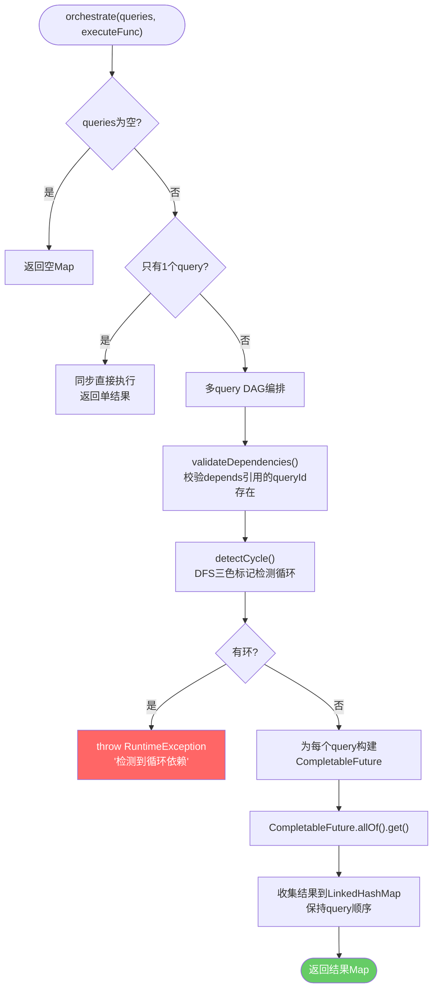

### 6.2 DAG 执行示意

以下是一个包含 4 个查询的 DAG 示例，展示并行与串行的执行时序：

```mermaid
gantt
    title DAG查询执行时序示例
    dateFormat X
    axisFormat %s

    section 并行执行
    q0 (无依赖)          : q0, 0, 100
    q2 (无依赖)          : q2, 0, 120

    section 等待依赖
    q1 (依赖q0)          : q1, 100, 200
    q3 (依赖q0,q1)       : q3, 200, 280
```

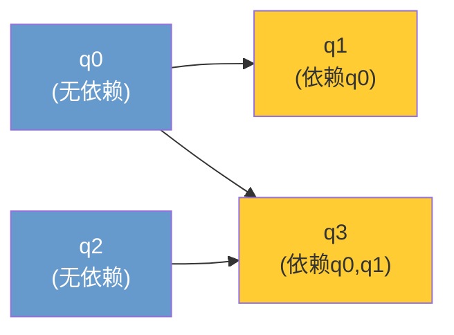

### 6.3 循环检测（DFS 三色标记）

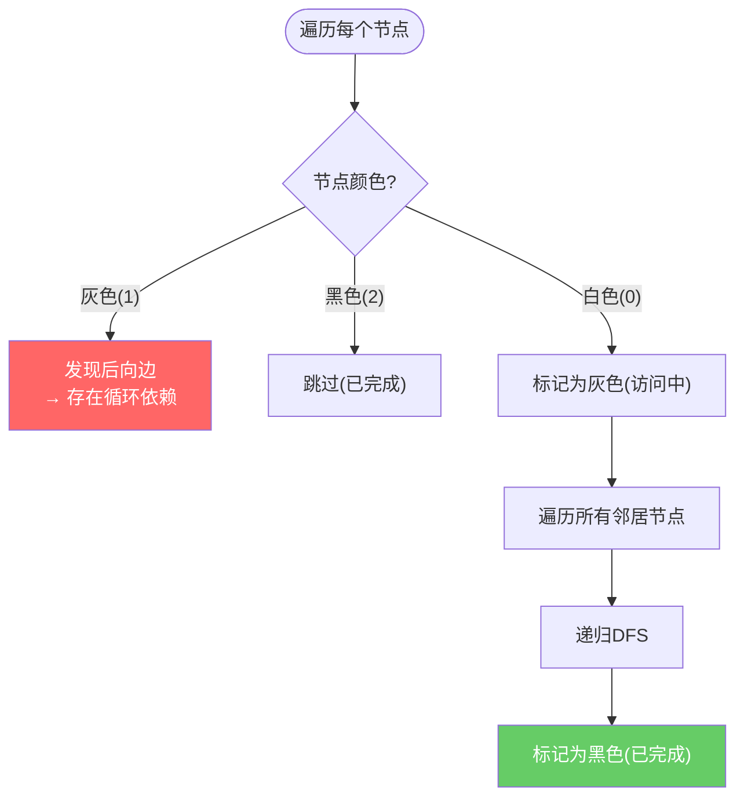

---

## 7. 各类型查询执行

### 7.1 SQL 查询（mysql/doris/sql/oracle/postgresql）

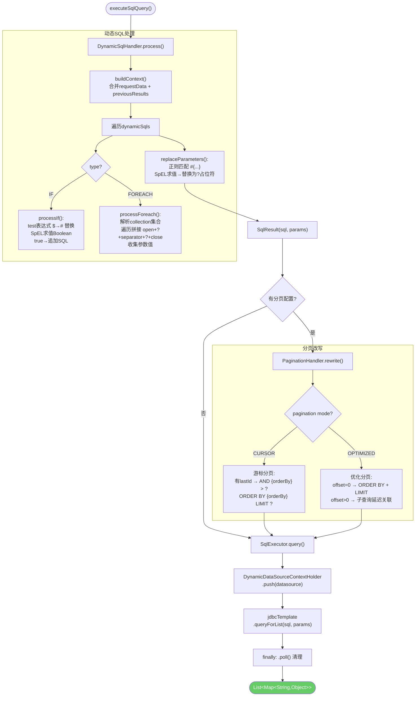

### 7.2 HTTP 查询

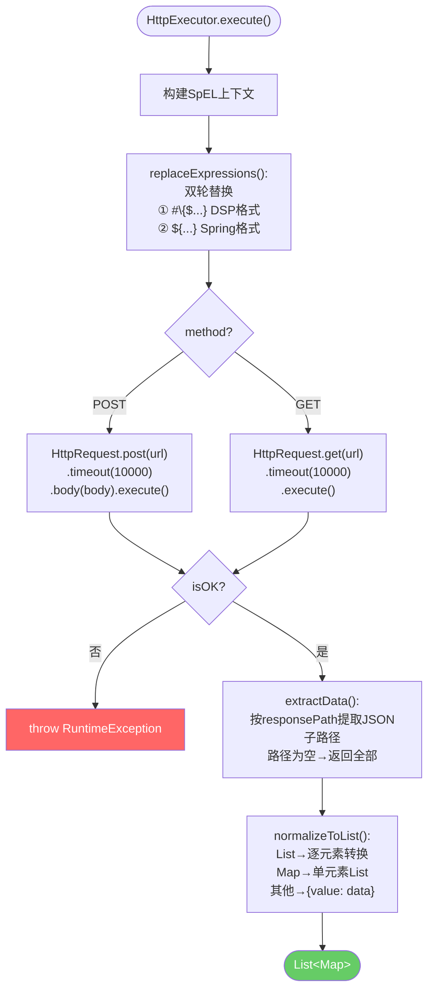

### 7.3 Dubbo 查询

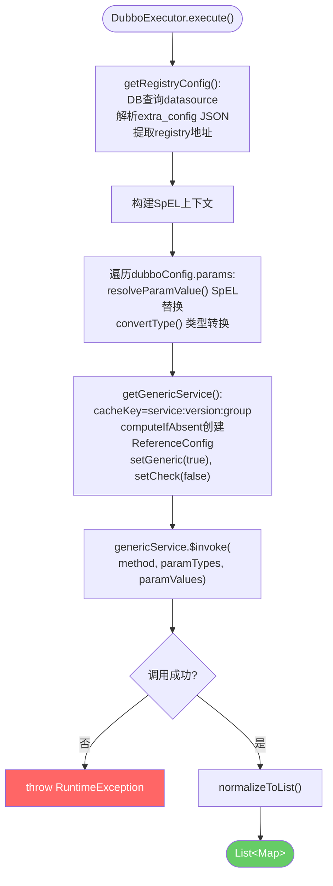

### 7.4 MongoDB 查询

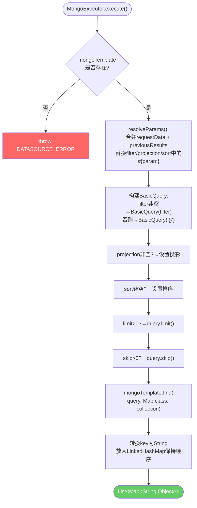

---

## 8. 结果映射与响应组装

### 8.1 字段映射 (ResultMapper.mapResult)

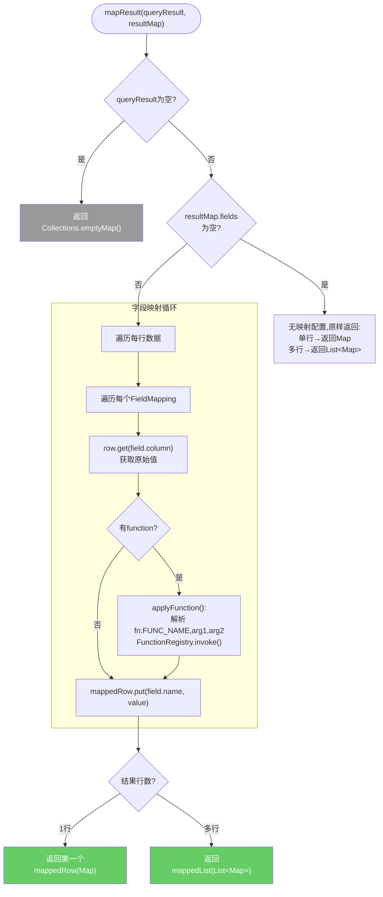

### 8.2 响应组装 (ResultMapper.buildResponse)

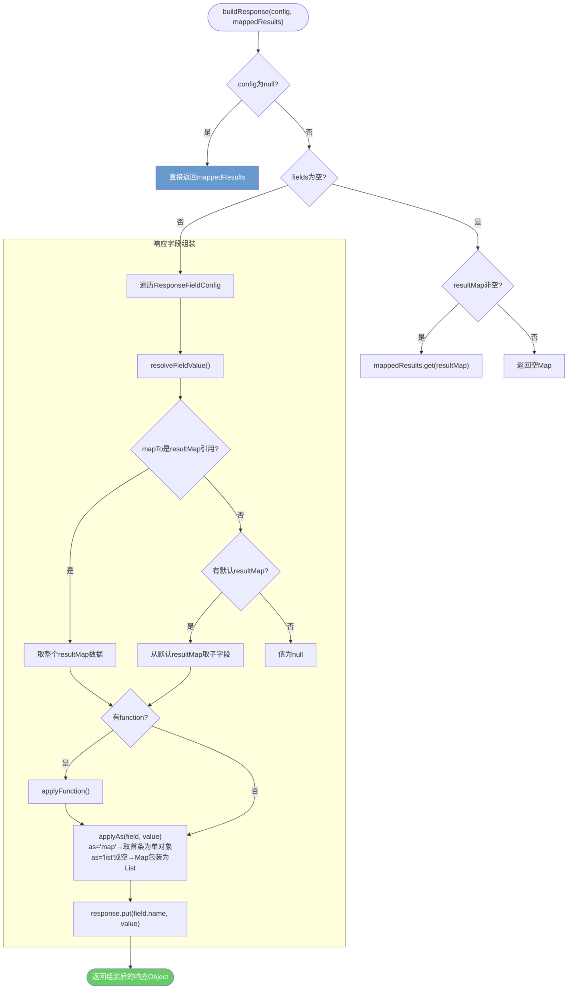

### 8.3 内置函数 (FunctionRegistry)

共 **29** 个内置函数，通过 `fn:FUNC_NAME,arg1,arg2` 语法在 resultMap 中调用：

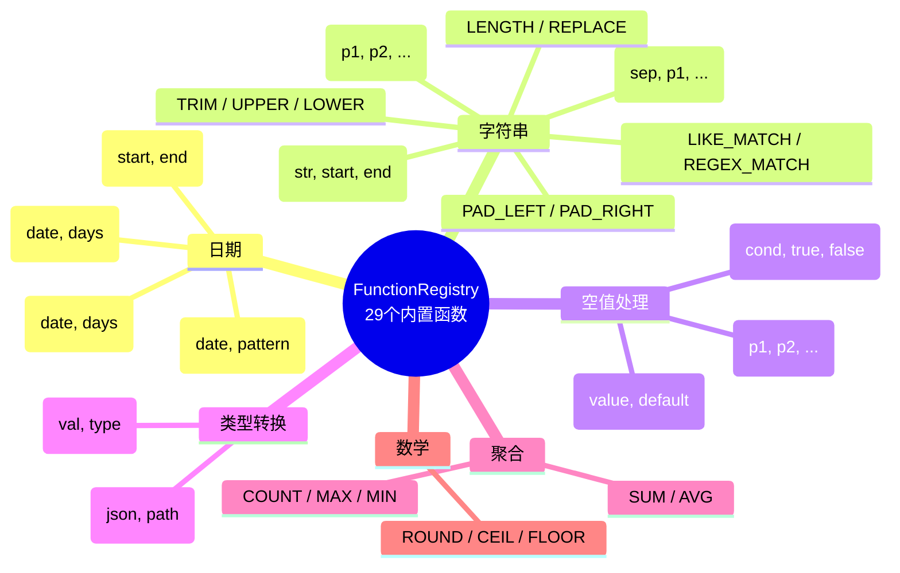

---

## 9. 审计日志 (AuditLogAspect)

通过 `@Around` 环绕通知，在请求前后均执行，确保无论成功失败都记录审计日志。

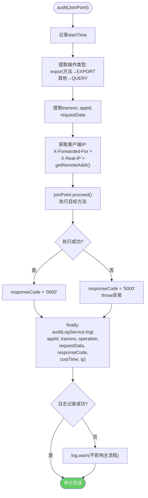

---

## 10. 异常处理体系

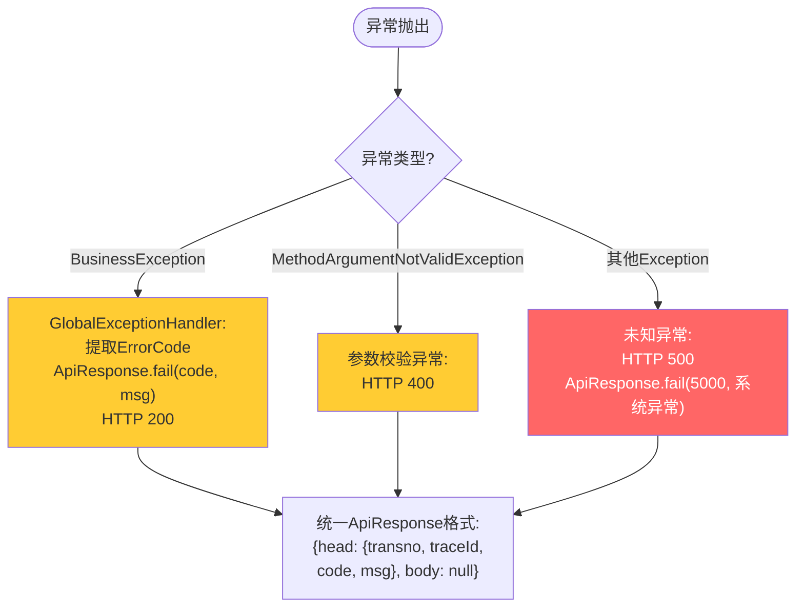

---

## 11. 统一报文格式

### 请求报文

```json
{
  "head": {
    "transno": "TRAN001",
    "appId": "app001",
    "token": "eyJhbGciOi...",
    "timestamp": "2026-05-07T10:30:00",
    "traceId": "uuid-xxx"
  },
  "requestData": {
    "param1": "value1",
    "ids": ["1", "2", "3"]
  }
}
```

### 响应报文

```json
{
  "head": {
    "transno": "TRAN001",
    "traceId": "uuid-xxx",
    "code": "0000",
    "msg": "成功"
  },
  "body": {
    "list": [...],
    "total": 100
  }
}
```

---

## 12. XML 配置完整示例

以下 XML 展示了引擎支持的所有特性：

```xml
<interface transno="TRAN001">
  <!-- 请求参数定义 -->
  <requestData>
    <param name="userId" type="string" required="true"/>
    <param name="status" type="string" required="false" defaultValue="1"/>
    <param name="ids" type="array" required="false"/>
    <param name="pageNo" type="integer" required="false" defaultValue="1"/>
    <param name="pageSize" type="integer" required="false" defaultValue="20"/>
  </requestData>

  <!-- 数据源引用（name指向数据库已配置的数据源） -->
  <datasource name="mysql_ds"/>

  <!-- 无依赖查询，可并行执行 -->
  <query id="q0" type="mysql" datasource="mysql_ds">
    <sql>SELECT id, name FROM users WHERE status = #{requestData.status}</sql>
  </query>

  <!-- 依赖q0，等待q0完成后执行 -->
  <query id="q1" type="mysql" datasource="mysql_ds" depends="q0">
    <sql>
      SELECT o.id, o.amount, o.create_time
      FROM orders o
      WHERE o.user_id = #{q0.id}
      AND status = #{requestData.status}
      <if test="requestData.ids != null">
        AND o.id IN
        <foreach collection="requestData.ids" item="id" open="(" close=")" separator=",">#{id}</foreach>
      </if>
    </sql>
  </query>

  <!-- HTTP查询 -->
  <query id="q2" type="http" datasource="http_ds">
    <http url="http://api.internal/user/${requestData.userId}/detail" method="GET" responsePath="$.data"/>
  </query>

  <!-- 游标分页查询 -->
  <query id="q3" type="mysql" datasource="mysql_ds"
         pagination="cursor" order-by="id"
         page-size-param="pageSize" last-id-param="lastId"
         max-page-size="1000">
    <sql>SELECT * FROM logs WHERE user_id = #{requestData.userId}</sql>
  </query>

  <!-- 结果映射 -->
  <resultMap id="rm1" query="q1">
    <field column="id" name="orderId"/>
    <field column="amount" name="amount" function="fn:ROUND,2"/>
    <field column="create_time" name="createTime" function="fn:DATE_FORMAT,yyyy-MM-dd HH:mm:ss"/>
  </resultMap>

  <resultMap id="rm2" query="q2">
    <field column="name" name="userName"/>
    <field column="avatar" name="avatarUrl" function="fn:IFNULL,https://default.avatar"/>
  </resultMap>

  <!-- 响应组装 -->
  <responseData resultMap="rm1">
    <field name="orders" mapTo="rm1" as="list"/>
    <field name="userInfo" mapTo="rm2" as="map"/>
    <field name="total" mapTo="rm3" function="fn:COUNT"/>
  </responseData>
</interface>
```

---

## 13. 执行阶段总览

| 阶段   | 组件              | 输入                       | 输出                        | 关键能力                                                    |
| ------ | ----------------- | -------------------------- | --------------------------- | ----------------------------------------------------------- |
| ① 鉴权 | JwtAuthAspect     | ApiRequest                 | —                           | JWT 校验、时间戳防重放、transno 白名单                      |
| ② 审计 | AuditLogAspect    | ProceedingJoinPoint        | —                           | @Around 环绕，记录请求/响应/耗时/IP                         |
| ③ 缓存 | CacheManager      | transno                    | InterfaceConfig             | ConcurrentHashMap 缓存，定时刷新，按需失效                  |
| ④ 解析 | XmlConfigParser   | XML 字符串                 | InterfaceConfig             | DOM4J 解析，支持 SQL/HTTP/Dubbo/Mongo 四种查询类型          |
| ⑤ 校验 | XmlEngine         | requestData                | —                           | 必填参数校验，defaultValue 回退                             |
| ⑥ 编排 | QueryOrchestrator | List\<QueryConfig\>        | Map\<queryId, List\<Map\>\> | DAG 依赖排序，CompletableFuture 并行，DFS 循环检测          |
| ⑦ 执行 | 各 Executor       | 查询配置+参数              | List\<Map\>                 | SQL(动态 SQL+分页)、HTTP(SpEL 替换)、Dubbo(泛化调用)、Mongo |
| ⑧ 映射 | ResultMapper      | 查询结果+resultMap         | 映射后数据                  | 字段重命名、fn:函数调用                                     |
| ⑨ 组装 | ResultMapper      | mappedResults+responseData | 最终响应 Object             | 多 resultMap 合并、嵌套结构                                 |
